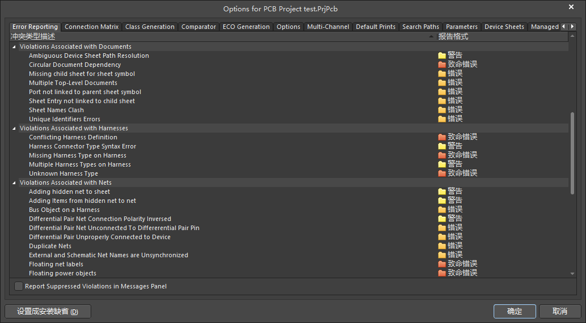
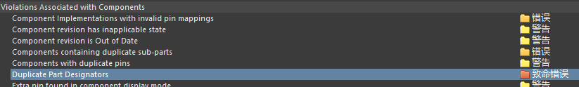
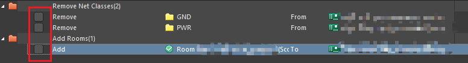

AD20软件基本使用流程

<!--more-->

# 原理图报错设置

工程->工程选项（快捷键：co）

需要修改的：（根据b站凡亿教育）

`Violations Associated with Components`下的`Duplicate Part Designators`，重复命名问题

`Violations Associated with Nets`：`Floating net labels` 和`Floating power objects`，悬浮问题。`Nets with only one pin`，单端网络问题。

# 规则设置

## 间距规则

`Electrical`->`Clearance`：最小间距5mil

## 线宽规则

`Routing` -> `Width`

射频线需要仿真确定线宽，连线时可以先设置为10mil

电源线宽度为20mil或30mil，连到器件前一点的时候可以减小为10mil

## 过孔规则

`Routing` -> `Routing Via Style`

盘的大小 = 过孔大小 * 2 ± 2 mil

注意区分 Hole Size 和 Diameter

过孔放置时默认不会按规则来，还需要去AD设置里，AD界面右上角进入设置：`PCB Editor`->`Defaults`，右边最下边选择via，设置默认Hole Size 和 Diameter为最常用的，其他大小可以放置后手动调大小

## 铺铜规则

- 正片：默认无铜，走线和铺铜意味着这些地方有铜
- 负片：默认有铜，走线和铺铜意味着这些地方无铜

`plane`

# 操作相关

## PcbDoc文件常用操作：

<mark>注意有的快捷键受中文输入法影响</mark>

- **切换PCB整体高亮**：`Shift + s`，在三个等级间切换，我习惯在默认情况下排版，第二个等级上（按一次Shift + s）情况下连线

- 高量网络net：按住Ctrl点击某个网络，相应的所有相同网络高亮。按住Ctrl点击其他位置，取消高亮

- **连线**：`Ctrl + w`

- 连线时调节线宽：在连线时按`3`可以在规则设置中的**最小宽度**、**首选宽度**、**最大宽度**切换

- 走弧线：pcb界面中上方放置栏，右击最右边的线条模样的，选择圆弧（边沿），放置时按空格切换弧线方向

- 选择单个器件：不要点击到焊盘，这样会选择到焊盘。点丝印（黄色）或其他

- 放置过孔：放置过孔后需要双击，在右边属性栏的Net选择相应网络，否则没法相连

- **对齐**：选择要对齐的器件，按A。常用的：左右、顶底对齐；垂直、水平分布；**两个焊盘的中心对齐**：水平、垂直中心对齐

- **交叉选择**：原理图SchDoc界面，选择：工具->交叉选择模式。分屏的时候，在原理图上选择的器件，会在pcb上高亮

- **器件按矩形摆放**：选择器件后按 `t + o + l` ，画一个矩形，对应器件会自动排列在这个矩形中。应用：将原理图导入到PCB后，想在PCB上按不同部分分开摆放，原理图选择某部分的器件（如某个芯片及其外接的电阻容等），在PCB文件中，对应器件会高亮，想把这些器件摆放在一起，可以在选择pcb文件后（鼠标右键在pcb界面轻微移动一下即可，左键点容易把高亮消除），按快捷键 t + o + l，画一个矩形，对应器件会自动排列在这个矩形中。

- 更改封装：如果只是在对应的封装库更改，需要选择左下角PCB Library在封装库对应封装右击，选择 'Update PCB With xx'。如果改了封装，需要在原理图：工具->封装管理器，选择新的封装库和对应封装，然后再在新的封装库右击选择'Update PCB With xx'

- **切换距离单位**：空白处按`q`，切换mil和mm

- 测距：`Ctrl + m`

- 取消测距：消除测距的数据：`Shift + c`

- **隐藏地网络**：地一般通过铺铜相连，并不需要连线，不需要显示出GND的连接关系。在PCB，点击：设计->类，右击Net Classes，添加类，取类名，将地网络（如GND）添加到类成员中，确定。再在AD左下角选择PCB，可以看到创建的Net Classes，右击对应的类，连接->隐藏，即可隐藏GND。其他Net也可通过类似方法隐藏

- 从原理图更新到PCB：每次修改原理图后，要更新PCB，在原理图选择：设计->update PCB Document ... 弹出的界面**要取消勾选下列选项**（或类似选项）

  

